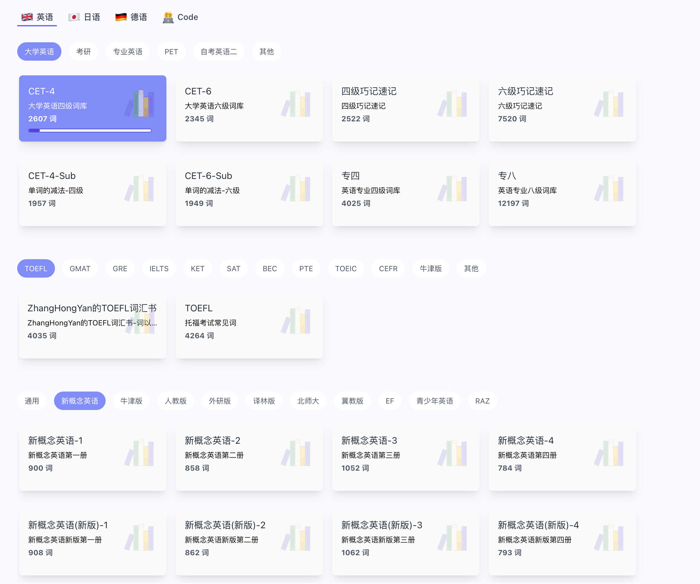

[qwerty-learner](https://qwerty.kaiyi.cool/) 词典数据解析脚本。

# qwerty learner 词典目录

- [BEC_2 2753 词](./dict/BEC_2/BEC_2.md)
- [BEC_3 2825 词](./dict/BEC_3/BEC_3.md)
- [BeiShiGaoZhong_1 226 词](./dict/BeiShiGaoZhong_1/BeiShiGaoZhong_1.md)
- [BeiShiGaoZhong_2 244 词](./dict/BeiShiGaoZhong_2/BeiShiGaoZhong_2.md)
- [BeiShiGaoZhong_3 295 词](./dict/BeiShiGaoZhong_3/BeiShiGaoZhong_3.md)
- [BeiShiGaoZhong_4 336 词](./dict/BeiShiGaoZhong_4/BeiShiGaoZhong_4.md)
- [BeiShiGaoZhong_5 327 词](./dict/BeiShiGaoZhong_5/BeiShiGaoZhong_5.md)
- [BeiShiGaoZhong_6 271 词](./dict/BeiShiGaoZhong_6/BeiShiGaoZhong_6.md)
- [BeiShiGaoZhong_7 334 词](./dict/BeiShiGaoZhong_7/BeiShiGaoZhong_7.md)
- [BeiShiGaoZhong_8 364 词](./dict/BeiShiGaoZhong_8/BeiShiGaoZhong_8.md)
- [BeiShiGaoZhong_9 299 词](./dict/BeiShiGaoZhong_9/BeiShiGaoZhong_9.md)
- [BeiShiGaoZhong_10 267 词](./dict/BeiShiGaoZhong_10/BeiShiGaoZhong_10.md)
- [BeiShiGaoZhong_11 330 词](./dict/BeiShiGaoZhong_11/BeiShiGaoZhong_11.md)
- [CET4_1 1162 词](./dict/CET4_1/CET4_1.md)
- [CET4_2 3739 词](./dict/CET4_2/CET4_2.md)
- [CET-4 大学英语四级词库 2607 词](./dict/CET4_3/CET4_3.md)
- [CET4luan_1 1162 词](./dict/CET4luan_1/CET4luan_1.md)
- [CET4luan_2 3739 词](./dict/CET4luan_2/CET4luan_2.md)
- [CET6_1 1228 词](./dict/CET6_1/CET6_1.md)
- [CET6_2 2078 词](./dict/CET6_2/CET6_2.md)
- [CET-6 大学英语六级词库 2345 词](./dict/CET6_3/CET6_3.md)
- [CET6luan_1 1228 词](./dict/CET6luan_1/CET6luan_1.md)
- [ChuZhong_2](./dict/ChuZhong_2/ChuZhong_2.md)
- [ChuZhong_3](./dict/ChuZhong_3/ChuZhong_3.md)
- [ChuZhongluan_2](./dict/ChuZhongluan_2/ChuZhongluan_2.md)
- [GMAT_2](./dict/GMAT_2/GMAT_2.md)
- [GMAT_3](./dict/GMAT_3/GMAT_3.md)
- [GMATluan_2](./dict/GMATluan_2/GMATluan_2.md)
- [GRE_2](./dict/GRE_2/GRE_2.md)
- [GRE_3](./dict/GRE_3/GRE_3.md)
- [GaoZhong_2](./dict/GaoZhong_2/GaoZhong_2.md)
- [GaoZhong_3](./dict/GaoZhong_3/GaoZhong_3.md)
- [GaoZhongluan_2](./dict/GaoZhongluan_2/GaoZhongluan_2.md)
- [IELTS_2](./dict/IELTS_2/IELTS_2.md)
- [IELTS_3](./dict/IELTS_3/IELTS_3.md)
- [IELTSluan_2](./dict/IELTSluan_2/IELTSluan_2.md)
- [KaoYan_1](./dict/KaoYan_1/KaoYan_1.md)
- [KaoYan_2 4533 词](./dict/KaoYan_2/KaoYan_2.md)
- [KaoYan_3](./dict/KaoYan_3/KaoYan_3.md)
- [KaoYanluan_1](./dict/KaoYanluan_1/KaoYanluan_1.md)
- [Level4_1](./dict/Level4_1/Level4_1.md)
- [Level4_2](./dict/Level4_2/Level4_2.md)
- [Level4luan_1](./dict/Level4luan_1/Level4luan_1.md)
- [Level4luan_2 4025 词](./dict/Level4luan_2/Level4luan_2.md)
- [Level8_1](./dict/Level8_1/Level8_1.md)
- [Level8_2](./dict/Level8_2/Level8_2.md)
- [Level8luan_2 12197 词](./dict/Level8luan_2/Level8luan_2.md)
- [PEPChuZhong7_1](./dict/PEPChuZhong7_1/PEPChuZhong7_1.md)
- [PEPChuZhong7_2](./dict/PEPChuZhong7_2/PEPChuZhong7_2.md)
- [PEPChuZhong8_1](./dict/PEPChuZhong8_1/PEPChuZhong8_1.md)
- [PEPChuZhong8_2](./dict/PEPChuZhong8_2/PEPChuZhong8_2.md)
- [PEPChuZhong9_1](./dict/PEPChuZhong9_1/PEPChuZhong9_1.md)
- [PEPGaoZhong_1](./dict/PEPGaoZhong_1/PEPGaoZhong_1.md)
- [PEPGaoZhong_10](./dict/PEPGaoZhong_10/PEPGaoZhong_10.md)
- [PEPGaoZhong_11](./dict/PEPGaoZhong_11/PEPGaoZhong_11.md)
- [PEPGaoZhong_2](./dict/PEPGaoZhong_2/PEPGaoZhong_2.md)
- [PEPGaoZhong_3](./dict/PEPGaoZhong_3/PEPGaoZhong_3.md)
- [PEPGaoZhong_4](./dict/PEPGaoZhong_4/PEPGaoZhong_4.md)
- [PEPGaoZhong_5](./dict/PEPGaoZhong_5/PEPGaoZhong_5.md)
- [PEPGaoZhong_6](./dict/PEPGaoZhong_6/PEPGaoZhong_6.md)
- [PEPGaoZhong_7](./dict/PEPGaoZhong_7/PEPGaoZhong_7.md)
- [PEPGaoZhong_8](./dict/PEPGaoZhong_8/PEPGaoZhong_8.md)
- [PEPGaoZhong_9](./dict/PEPGaoZhong_9/PEPGaoZhong_9.md)
- [PEPXiaoXue3_1](./dict/PEPXiaoXue3_1/PEPXiaoXue3_1.md)
- [PEPXiaoXue3_2](./dict/PEPXiaoXue3_2/PEPXiaoXue3_2.md)
- [PEPXiaoXue4_1](./dict/PEPXiaoXue4_1/PEPXiaoXue4_1.md)
- [PEPXiaoXue4_2](./dict/PEPXiaoXue4_2/PEPXiaoXue4_2.md)
- [PEPXiaoXue5_1](./dict/PEPXiaoXue5_1/PEPXiaoXue5_1.md)
- [PEPXiaoXue5_2](./dict/PEPXiaoXue5_2/PEPXiaoXue5_2.md)
- [PEPXiaoXue6_1](./dict/PEPXiaoXue6_1/PEPXiaoXue6_1.md)
- [PEPXiaoXue6_2](./dict/PEPXiaoXue6_2/PEPXiaoXue6_2.md)
- [SAT_2](./dict/SAT_2/SAT_2.md)
- [SAT_3](./dict/SAT_3/SAT_3.md)
- [TOEFL_2](./dict/TOEFL_2/TOEFL_2.md)
- [TOEFL_3](./dict/TOEFL_3/TOEFL_3.md)
- [WaiYanSheChuZhong_1](./dict/WaiYanSheChuZhong_1/WaiYanSheChuZhong_1.md)
- [WaiYanSheChuZhong_2](./dict/WaiYanSheChuZhong_2/WaiYanSheChuZhong_2.md)
- [WaiYanSheChuZhong_3](./dict/WaiYanSheChuZhong_3/WaiYanSheChuZhong_3.md)
- [WaiYanSheChuZhong_4](./dict/WaiYanSheChuZhong_4/WaiYanSheChuZhong_4.md)
- [WaiYanSheChuZhong_5](./dict/WaiYanSheChuZhong_5/WaiYanSheChuZhong_5.md)
- [WaiYanSheChuZhong_6](./dict/WaiYanSheChuZhong_6/WaiYanSheChuZhong_6.md)